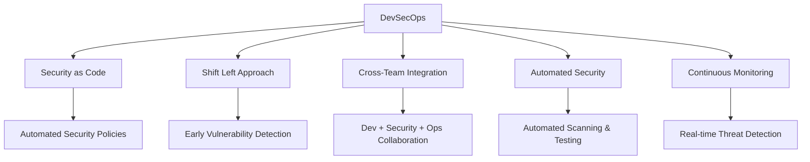

# Web Application Security & Testing Framework

## 📋 Comprehensive Testing Methodology

### 1. **Functional Testing** ✅
Verifies application correctness through systematic validation:

| Testing Type | Purpose | Key Focus Areas |
|-------------|---------|----------------|
| **Unit Testing** | Individual component validation | Single functions, methods, classes |
| **Integration Testing** | Component interaction verification | APIs, interfaces, data flow |
| **System Testing** | Complete system evaluation | End-to-end workflows, specifications |
| **Smoke & Sanity Testing** | Critical functionality check | Core features, build stability |

### 2. **Non-Functional Testing** ⚡
Assesses performance, security, and usability aspects:

- **Performance Testing**
  - *Load Testing*: Normal operating conditions
  - *Stress Testing*: Beyond normal capacity
  - *Scalability Testing*: Growth accommodation

- **Security Testing**
  - Vulnerability identification (SQL injection, XSS, CSRF)
  - Authentication & authorization testing
  - Data protection validation

- **Usability Testing**
  - User interface intuitiveness
  - Navigation efficiency
  - Accessibility compliance

- **Compatibility Testing**
  - Cross-browser functionality
  - Multi-device responsiveness
  - OS compatibility

### 3. **UI/UX Testing** 🎨
- **UI Testing**: Visual element verification (layout, colors, fonts)
- **UX Testing**: Overall user experience assessment

### 4. **Regression Testing** 🔄
Ensures new updates don't break existing functionality through:
- Automated test suites
- Critical path verification
- Impact analysis

### 5. **Acceptance Testing** ✅
- **Alpha Testing**: Internal stakeholder validation
- **Beta Testing**: External user feedback collection

### 6. **API Testing** 🔌
- Functional endpoint validation
- Security assessment
- Performance benchmarking
- Data structure verification

### 7. **Database Testing** 🗄️
- Data integrity validation
- Query performance optimization
- Security compliance
- Migration verification

### 8. **Cross-Browser/Device Testing** 🌐
- Browser compatibility matrix
- Responsive design validation
- Touch interface testing

### 9. **Security Testing** 🛡️
- Penetration testing
- Vulnerability scanning
- Security compliance auditing

### 10. **Exploratory Testing** 🔍
- Ad-hoc issue discovery
- Usability assessment
- Edge case identification

### 11. **End-to-End Testing** 📊
- Complete user journey simulation
- Integration point validation
- Real-world scenario testing

---

## 🔒 DevSecOps Integration

### **Core Principles**



### **Implementation Framework**

| Stage | Security Activities | Tools |
|-------|-------------------|-------|
| **Plan** | Threat modeling, Security requirements | JIRA, Confluence |
| **Code** | SAST, Secret detection, Code review | SonarQube, Checkmarx, GitGuardian |
| **Build** | Dependency scanning, Container security | Snyk, Trivy, Docker Scout |
| **Test** | DAST, IAST, Security testing | OWASP ZAP, Burp Suite |
| **Deploy** | Infrastructure scanning, Configuration audit | Terraform, Ansible, CloudFormation |
| **Operate** | Runtime protection, Incident response | Splunk, Datadog, WAF |

### **Key Benefits**
- 🚀 **Faster Vulnerability Discovery**
- 💰 **Reduced Remediation Costs**
- 🤝 **Improved Team Collaboration**
- 🛡️ **Enhanced Security Posture**
- ⚡ **Accelerated Delivery**

---

## 🛠️ SAST vs DAST Comparison

### **Static Application Security Testing (SAST)**
**When**: Early development phase (Shift Left)
**What**: Source code/bytecode analysis
**How**: Without executing application

**Top Tools:**
- **SonarQube** - Open-source quality platform
- **Checkmarx** - Comprehensive source scanning
- **Fortify SCA** - Enterprise static analysis
- **Veracode** - Automated secure code review
- **Coverity** - Critical defect detection

### **Dynamic Application Security Testing (DAST)**
**When**: Testing/staging phases
**What**: Running application analysis
**How**: Simulating real-world attacks

**Top Tools:**
- **OWASP ZAP** - Open-source penetration testing
- **Burp Suite** - Professional security toolkit
- **Acunetix** - Automated web vulnerability scanner
- **Netsparker** - Proof-based scanning technology
- **AppScan** - Enterprise application security

---

## 🛡️ Web Application Security Checklist

### 1. **Authentication & Authorization**
- [ ] Implement Multi-Factor Authentication (MFA)
- [ ] Enforce strong password policies
- [ ] Use secure session management
- [ ] Implement Role-Based Access Control (RBAC)
- [ ] Apply principle of least privilege

### 2. **Data Protection**
- [ ] Enforce HTTPS (TLS 1.2+)
- [ ] Encrypt data at rest (AES-256)
- [ ] Hash passwords (bcrypt/Argon2)
- [ ] Implement proper key management
- [ ] Regular data backup and encryption

### 3. **Input Validation & Sanitization**
- [ ] Validate all user inputs
- [ ] Sanitize output data
- [ ] Implement Content Security Policy (CSP)
- [ ] Use parameterized queries
- [ ] Escape special characters

### 4. **Secure Coding Practices**
- [ ] Regular SAST/DAST scanning
- [ ] Dependency vulnerability management
- [ ] Avoid hardcoded secrets
- [ ] Implement secure error handling
- [ ] Follow OWASP Top 10 guidelines

### 5. **Security Headers Implementation**
```
Content-Security-Policy: default-src 'self'
Strict-Transport-Security: max-age=31536000
X-Frame-Options: DENY
X-Content-Type-Options: nosniff
Referrer-Policy: strict-origin-when-cross-origin
```

### 6. **Monitoring & Incident Response**
- [ ] Comprehensive activity logging
- [ ] Real-time threat monitoring
- [ ] Automated alert systems
- [ ] Incident response plan
- [ ] Regular security audits

### 7. **Infrastructure Security**
- [ ] Web Application Firewall (WAF)
- [ ] Regular system patching
- [ ] Network segmentation
- [ ] DDoS protection
- [ ] Secure configuration management

---

## 📊 Testing Strategy Visualizations

### Testing Pyramid
```
       /-----------\
      /  E2E Tests  \    (5-10%)
     /---------------\
    / Integration Tests \  (15-20%)
   /-------------------\
  /     Unit Tests      \  (70-80%)
 /-----------------------\
```
*Ideal test distribution for maximum efficiency*

### DevSecOps Pipeline
```
Code Commit → SAST Scan → Build → DAST Scan → 
Deploy to Staging → Security Scan → 
Penetration Test → Production Deployment → 
Continuous Monitoring
```

---

## 🚀 Best Practices & Recommendations

### Testing Excellence
- **Test Early, Test Often**: Implement Shift-Left testing approach
- **Automate Repetitive Tests**: Focus manual testing on complex scenarios
- **Use Real Devices**: For accurate cross-browser/device testing
- **Clear Documentation**: Maintain reusable, well-documented test cases
- **Continuous Integration**: Integrate testing into CI/CD pipelines

### Security First
- **Regular Training**: Keep developers updated on security best practices
- **Automated Compliance**: Integrate security checks into deployment pipelines
- **Threat Modeling**: Conduct regular security architecture reviews
- **Bug Bounty Programs**: Engage security researchers for vulnerability discovery
- **Security Champions**: Designate team members as security advocates

### Performance Optimization
- **Load Testing**: Regular performance benchmarking
- **Monitoring Alerts**: Proactive performance issue detection
- **Capacity Planning**: Anticipate growth requirements
- **Caching Strategy**: Implement effective caching mechanisms

---

## 🔧 Recommended Tool Stack

| Category | Recommended Tools | Purpose |
|----------|------------------|---------|
| **Test Automation** | Selenium, Cypress, Playwright | Web UI testing |
| **API Testing** | Postman, SoapUI, REST Assured | API validation |
| **Performance** | JMeter, Gatling, k6 | Load & stress testing |
| **Security** | OWASP ZAP, Burp Suite, Nessus | Vulnerability assessment |
| **Cross-Browser** | BrowserStack, Sauce Labs, LambdaTest | Compatibility testing |
| **Monitoring** | Splunk, Datadog, New Relic | Application monitoring |
| **CI/CD** | Jenkins, GitLab CI, GitHub Actions | Pipeline automation |
| **Container Security** | Trivy, Clair, Anchore | Image vulnerability scanning |

---

## 📈 Metrics & KPIs

### Quality Metrics
- **Test Coverage**: Target >80% code coverage
- **Defect Density**: <1 defect per 1000 lines of code
- **Mean Time to Detection (MTTD)**: <1 hour for critical issues
- **Mean Time to Resolution (MTTR)**: <4 hours for critical fixes

### Security Metrics
- **Vulnerability Remediation Rate**: >90% within SLA
- **Security Test Coverage**: 100% of critical components
- **Penetration Test Findings**: Quarterly reduction trend
- **Security Training Completion**: 100% developer participation

### Performance Metrics
- **Response Time**: <2 seconds for 95% of requests
- **Uptime**: 99.9% availability
- **Error Rate**: <0.1% of total requests
- **Throughput**: Meets business requirements

---

## 🔄 Continuous Improvement

1. **Regular Retrospectives**
   - Analyze testing effectiveness
   - Identify process bottlenecks
   - Implement improvement actions

2. **Stay Updated**
   - Monitor emerging security threats
   - Update testing methodologies
   - Adopt new tools and technologies

3. **Knowledge Sharing**
   - Conduct internal workshops
   - Maintain knowledge base
   - Cross-team collaboration

4. **Feedback Loops**
   - User feedback integration
   - Production monitoring insights
   - Performance metrics analysis

---

## 📚 Additional Resources

- **OWASP Top 10**: Latest application security risks
- **NIST Cybersecurity Framework**: Security best practices
- **ISO 27001**: Information security management
- **GDPR/CCPA**: Data protection regulations
- **Industry-specific Compliance**: PCI DSS, HIPAA, etc.

---

*Last Updated: Dec 2025*  
*Maintained by Security & QA Teams*  
*For questions or contributions, please contact the security team.*

---

**Remember**: Security is not a one-time activity but a continuous process. Regular updates, monitoring, and improvement are essential for maintaining a robust security posture in today's evolving threat landscape.
